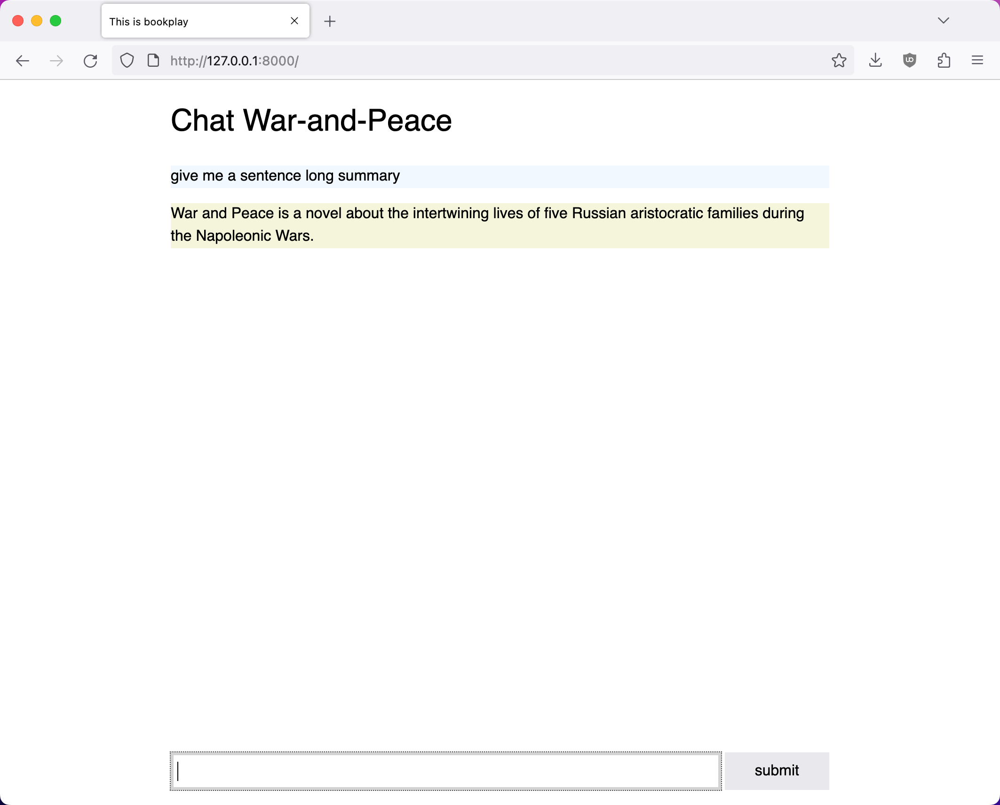
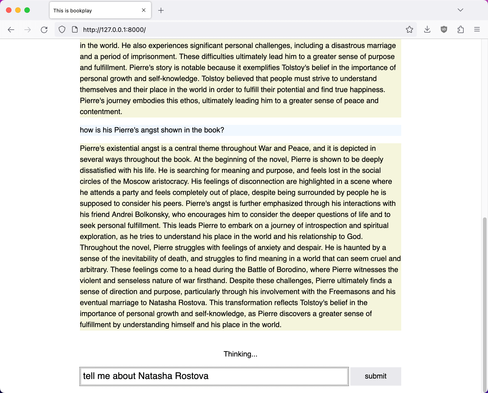

# bookplay

Understand a book using a chat personal assistant.

For Founders and Coders ML Hackathon:
https://www.meetup.com/founderscoders/events/291980799/





## Development

```sh
python3 -m venv .venv
source .venv/bin/activate
pip install -r requirements.txt
python manage.py runserver
```

## License

MIT
